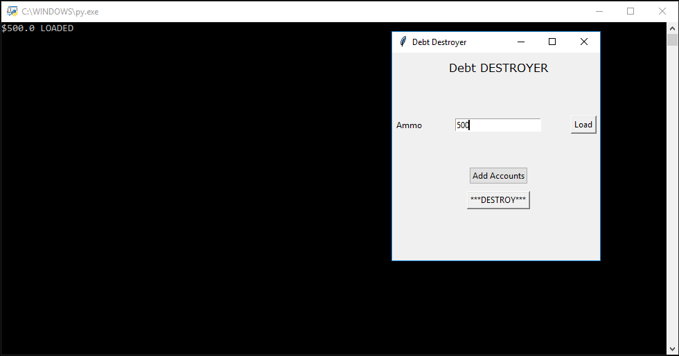
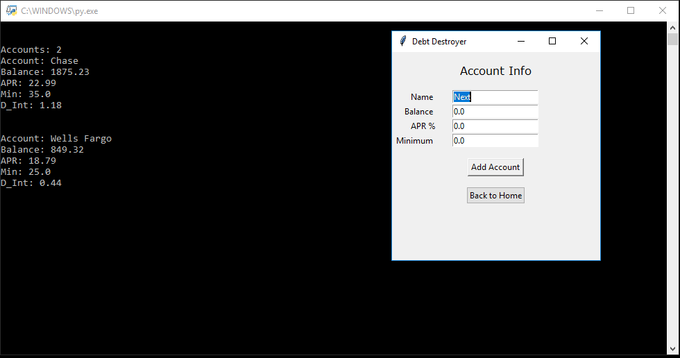
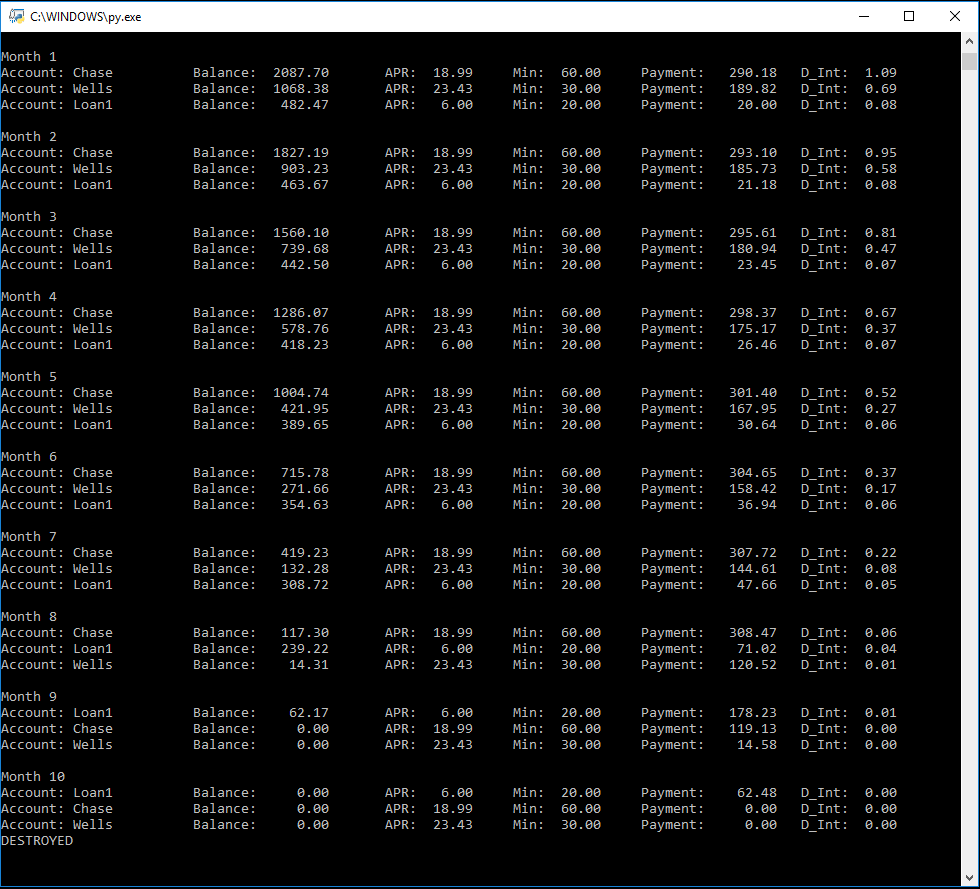

# DebtDestroyer_1.0
Debt Destroyer 1.0 for Concepts of Programming Languages Project

User inputs allocated funds "Ammo", and account names, balances, minimum payments, and APR's. Program applies payments to accounts
for each month in an efficient way that minimizes total interest paid. Prints a report of the payment plan to the console.

